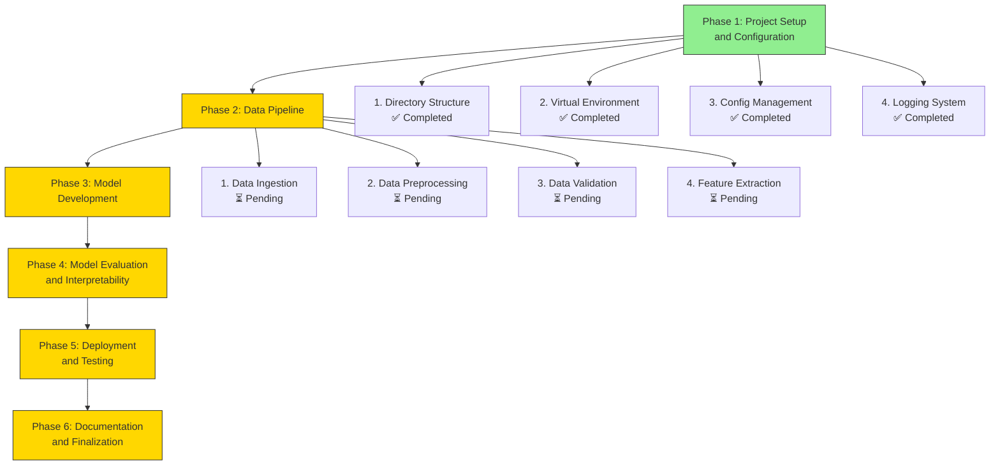

# Project Progress Overview

This document shows our current progress through the project phases.

## Phase Completion Status

## Legend

- ✅ **Completed**: Task finished and tested
- ⏳ **Pending**: Task not yet started
- 🚧 **In Progress**: Task currently being worked on

## Current Focus

We are now ready to begin **Phase 2: Data Pipeline**, which involves:
1. Collecting datasets for our text classification task
2. Cleaning and preparing the data for our AI models
3. Validating data quality
4. Extracting features using Hugging Face tokenizers

## Next Milestones

1. **Phase 2 Completion**: Fully functional data pipeline
2. **Phase 3 Completion**: Working model training and evaluation system
3. **Project Completion**: Deployable AI text classification system