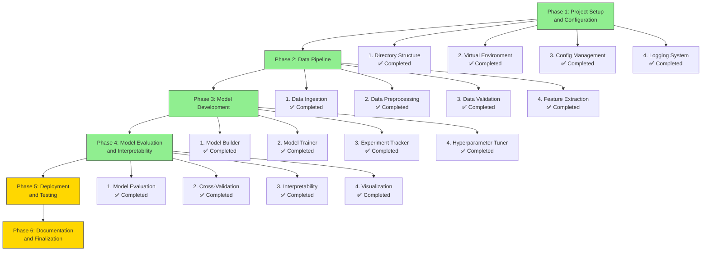

# Project Progress Overview

This document shows our current progress through the project phases.

## Phase Completion Status

## Legend

- ✅ **Completed**: Task finished and tested
- ⏳ **Pending**: Task not yet started
- 🚧 **In Progress**: Task currently being worked on

## Current Focus

We have now completed **Phase 4: Model Evaluation and Interpretability**, which involved:
1. Creating model evaluation module with multiple metrics
2. Implementing cross-validation for robust evaluation
3. Adding model interpretability using SHAP and LIME
4. Creating visualization tools for model analysis

## Next Steps

We are now ready to begin **Phase 5: Deployment and Testing**, which will involve:
1. Building FastAPI endpoint for model serving
2. Creating Dockerfile for containerization
3. Writing unit tests for all modules
4. Creating integration tests for the complete pipeline

## Next Milestones

1. **Phase 5 Completion**: Deployable AI text classification system
2. **Project Completion**: Fully documented and production-ready system