# Project Progress Overview

This document shows our current progress through the project phases.

## Phase Completion Status

```mermaid
graph TD
    A[Phase 1: Project Setup<br/>and Configuration] --> B[Phase 2: Data Pipeline]
    B --> C[Phase 3: Model Development]
    C --> D[Phase 4: Model Evaluation<br/>and Interpretability]
    D --> E[Phase 5: Deployment<br/>and Testing]
    E --> F[Phase 6: Documentation<br/>and Finalization]
    
    A --> A1[1. Directory Structure<br/>✅ Completed]
    A --> A2[2. Virtual Environment<br/>✅ Completed]
    A --> A3[3. Config Management<br/>✅ Completed]
    A --> A4[4. Logging System<br/>✅ Completed]
    
    B --> B1[1. Data Ingestion<br/>✅ Completed]
    B --> B2[2. Data Preprocessing<br/>✅ Completed]
    B --> B3[3. Data Validation<br/>✅ Completed]
    B --> B4[4. Feature Extraction<br/>✅ Completed]
    
    C --> C1[1. Model Builder<br/>✅ Completed]
    C --> C2[2. Model Trainer<br/>✅ Completed]
    C --> C3[3. Experiment Tracker<br/>✅ Completed]
    C --> C4[4. Hyperparameter Tuner<br/>✅ Completed]
    
    D --> D1[1. Model Evaluation<br/>✅ Completed]
    D --> D2[2. Cross-Validation<br/>✅ Completed]
    D --> D3[3. Interpretability<br/>✅ Completed]
    D --> D4[4. Visualization<br/>✅ Completed]
    
    E --> E1[1. API Development<br/>✅ Completed]
    E --> E2[2. Containerization<br/>✅ Completed]
    E --> E3[3. Unit Testing<br/>✅ Completed]
    E --> E4[4. Integration Testing<br/>✅ Completed]
    E --> E5[5. Docker Deployment<br/>✅ Completed]
    E --> E6[6. Basic API Verification<br/>✅ Completed]
    E --> E7[7. Model Loading Issues<br/>⚠️ In Progress]
    
    style A fill:#90EE90,stroke:#333
    style B fill:#90EE90,stroke:#333
    style C fill:#90EE90,stroke:#333
    style D fill:#90EE90,stroke:#333
    style E fill:#90EE90,stroke:#333
    style F fill:#FFD700,stroke:#333
```

## Legend

- ✅ **Completed**: Task finished and tested
- ⏳ **Pending**: Task not yet started
- 🚧 **In Progress**: Task currently being worked on
- ⚠️ **Issues**: Task completed with known issues

## Current Focus

We have now completed **Phase 5: Deployment and Testing**, which involved:
1. Building FastAPI endpoint for model serving
2. Creating Dockerfile for containerization
3. Writing unit tests for all modules
4. Creating integration tests for the complete pipeline
5. Successfully deploying Docker container
6. Verifying basic API functionality

We are currently working on resolving **model loading network issues** that are preventing the prediction endpoints from working properly.

## Next Steps

We are now ready to begin **Phase 6: Documentation and Finalization**, which will involve:
1. Creating comprehensive README with project overview
2. Documenting all modules and their usage
3. Creating example notebooks for demonstration
4. Running final end-to-end validation

## Next Milestones

1. **Phase 6 Completion**: Fully documented and production-ready system
2. **Project Completion**: Complete LLM-based text classification pipeline

## Known Issues

- Model loading is experiencing network connectivity issues in the containerized environment
- Prediction endpoints are timing out due to model loading problems